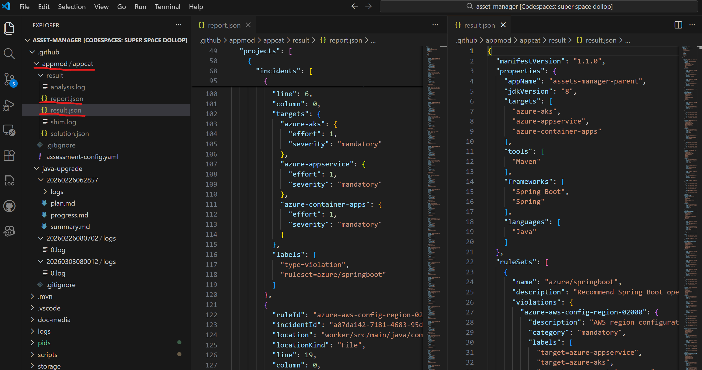
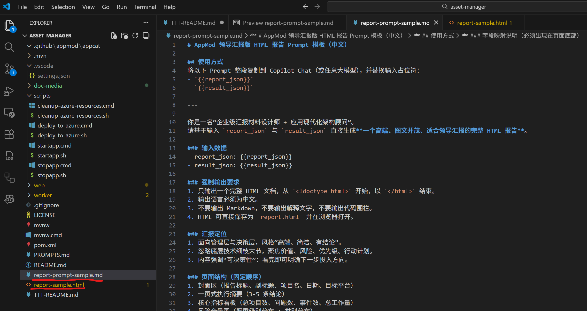
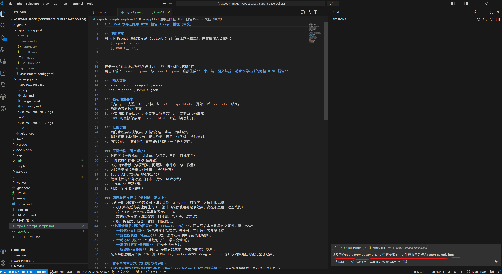
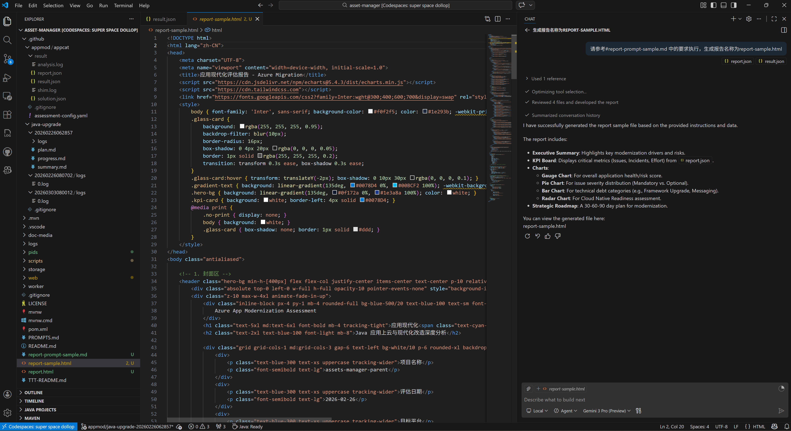
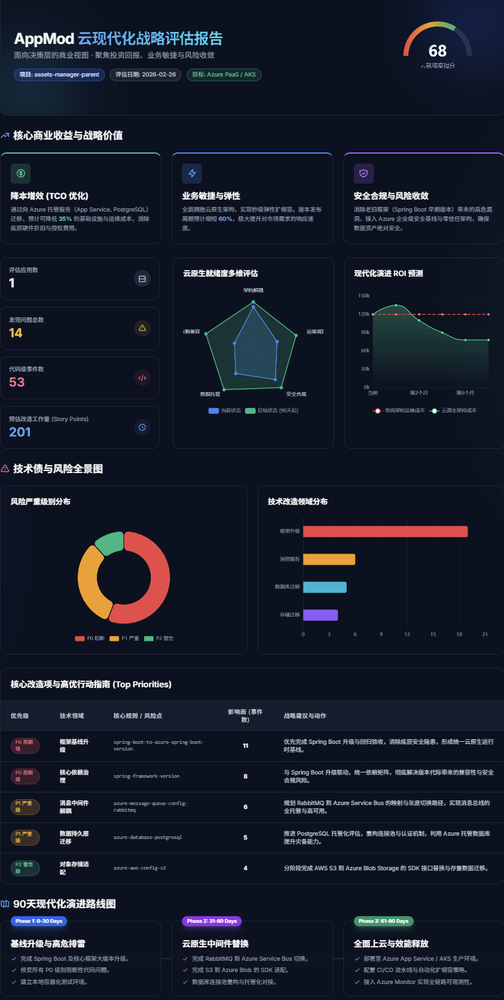

🚀 GH Copilot App Mod Java 应用现代化实验指南 (GitHub Codespaces 版)

欢迎参加 GitHub Copilot App Modernization 实验！本实验将带你把一个基于 Java 8 的遗留应用（Asset Manager）迁移到现代化的架构并做潜在的安全问题修复。

为了避免每个人本地计算机环境的差异带来的挑战，我们将全程使用 GitHub Codespaces。

🛠️ 第一阶段：准备工作 (实验前必做)

在启动环境之前，请确保你已经完成了以下配置：

GitHub 账号权限：

确保你的账号拥有 GitHub Copilot Business 或 Copilot Pro 等更高权限。

本地软件安装：

安装 Visual Studio Code。

在 VS Code 插件市场搜索并安装 GitHub Codespaces 扩展。

网络环境：

建议实验过程中保持网络稳定。如果实验过程中使用 WiFi 遇到连接断开，请尝试使用手机热点。

🏗️ 第二阶段：启动实验环境

我们将通过云端容器启动一个预装了 JDK 8、Maven 3.6+ 和 Docker 的标准化环境。

Fork代码仓库：https://github.com/yym2020/Copilot-App-Modernization-Java-Lab 到你的Github账户中，<span style="color:red">**注意请勿修改代码库名称**</span>

点击按钮 <> Code，切换到 Codespaces 选项卡。


关键步骤：点击 ... (更多选项) -> New with options...。

在配置页面：

Branch: 选择 main。

Dev Container Configuration: 务必选择 Java App Modernization Lab。

Region: 选择距离你最近的区域（如 Southeast Asia 或 East US）。

Machine Type: 选择2-core


点击 Create codespace。

💻 第三阶段：连接到本地 VS Code (推荐)
虽然浏览器可以运行，但在本地 VS Code 中操作会有更好的 Copilot 体验。

等待云端环境初始化（约 3-5 分钟）。

环境启动后，点击左下角的 "Codespaces" 状态栏，选择 "Open in VS Code Desktop"。


在本地弹出的 VS Code 窗口中，确认左下角显示 Codespaces: <名称>。


在本地VS Code窗口中默认配置根据图示选择“否”


✅ 第四阶段：环境验证与运行
环境启动后，它会自动执行初始化脚本。请在 VS Code 终端中检查：

1. 在VS Code中打开Terminal终端窗口：


2. 验证版本信息
输入以下命令，确认环境是否正确：

java -version (应显示为 1.8.x)

mvn -version (应显示为 3.6.x 或更高)


3. 运行初始应用
在终端中进入项目目录并构建：

./scripts/startapp.sh


4. 访问应用
当终端显示应用启动成功后，在VS Code端口界面中找到对应Web 应用在本地映射的路径


点击进入访问Asset manager应用


🤖 第五阶段：开始应用现代化 (AI 介入)
现在，你已经准备好使用 GitHub Copilot App Mod 进行代码改造了！

1. 点击左侧栏Github Copilot App Moddernization图标，点击Start Assessment启动对代码库的评估


2. 查看评估过程


3. 大约5分钟后，查看评估结果


4. 升级Java Runtime & Framework （耗时约10-15分钟）


5. 升级完成，查看升级报告：


✅ 第五阶段：定制化评估报告
App mod应用评估报告的数据文件默认保存在./.github/appmod/appcat目录下：



可以基于默认的报告数据进行自定义生成新的报告，用于向客户进行汇报。在repo中已经存在报告自定义的Prompt文件和示例自定义生成的报告文件：



将评估生成的报告数据文件report.json和result.json以及报告自定义prompt文件report-prompt-sample.md文件加到copilot chat对话上下文中并输入相应指令：






生成报告示例如下：



---

# GH Copilot App Mod Java 应用现代化实验指南 (本地离线分发版)

本章节作为对上方 Codespaces 版的补充说明，适用于合作伙伴现场访问 GitHub 不稳定、但本机可以联网并可正常使用 GitHub Copilot Chat 的场景。

本地版不会替代上方的 Codespaces 版流程。若学员可以稳定使用 Codespaces，优先按原文执行；若现场访问 GitHub 仓库或进入 Codespaces 不稳定，则使用以下本地版流程。

## 一、本地电脑准备

请学员在 workshop 开始前，在本地电脑完成以下准备。

| 工具 | 版本要求 | 用途 | 备注 | 提示词 |
|---|---|---|---|---|
| Visual Studio Code | 最新稳定版 | workshop 主操作界面 | Windows / macOS 都需要 | 帮我在当前操作系统上安装 Visual Studio Code，并告诉我安装完成后如何验证版本。 |
| GitHub Copilot | 已开通 Copilot Business / Pro | 用于后续借助 Copilot Chat 完成环境检查和实验执行 | 必须提前登录 GitHub 账号并确认可用 | 帮我检查当前 VS Code 是否已经登录 GitHub，并确认 GitHub Copilot 和 Copilot Chat 是否可用。 |
| JDK 8 | 1.8.x | 运行 workshop 的起始遗留应用 | 推荐 Eclipse Temurin 8；这是起始代码运行所需 | 请根据我的操作系统帮我安装 JDK 8，并指导我设置 JAVA_HOME 和 PATH，然后验证 java -version 显示 1.8。 |
| Docker Desktop | 最新稳定版 | 启动 PostgreSQL 和 RabbitMQ | 本地运行的关键依赖之一 | 请帮我在当前操作系统安装 Docker Desktop，并指导我验证 docker 能正常运行，以及如何执行 docker run hello-world。 |
| VS Code Java 扩展包 | 最新稳定版 | Java 项目识别、编译、调试 | 推荐安装 Extension Pack for Java | 请帮我在 VS Code 中安装 Java 开发所需的扩展，至少包括 Extension Pack for Java，并告诉我如何确认 Java 项目被正确识别。 |
| GitHub Copilot Chat 扩展 | 最新稳定版 | 让学员通过自然语言安装和检查环境 | 建议单独确认已启用 | 请帮我在 VS Code 中检查 GitHub Copilot Chat 是否已安装并启用，如果没有请指导我安装。 |
| Java 升级 / 现代化相关扩展 | 最新稳定版 | 用于 assessment 和后续 Java modernization | 建议提前装好 | 请帮我在 VS Code 中安装和 Java modernization / assessment 相关的扩展，并告诉我安装后如何确认它们已经生效。 |

## 二、可以不要求单独安装的工具

| 工具 | 是否必须单独安装 | 原因 | 建议提示词 |
|---|---|---|---|
| Maven | 不必须 | 仓库已经带了 `mvnw` / `mvnw.cmd`，优先使用 Maven Wrapper | 请检查这个项目是否已经自带 Maven Wrapper，并告诉我应该使用 mvnw 还是本地 Maven。 |
| Git | 非必须 | 如果是直接解压 zip 做实验，不依赖 git clone | 如果这个 workshop 是从 zip 解压运行，请告诉我是否需要单独安装 Git。 |
| JDK 21 | 不作为前置必须 | 这是升级后的目标版本，不是实验起点必需 | 这个项目当前起始代码运行需要哪个 JDK 版本？升级目标版本又是什么？请告诉我是否需要现在就安装 JDK 21。 |

## 三、操作系统补充说明

### Windows 学员

- 请优先确认 Docker Desktop 能正常安装和启动。
- 如果企业电脑禁用了虚拟化、Hyper-V 或 WSL2，Docker Desktop 可能无法使用，这是现场最常见阻塞点。
- Windows 请使用 `scripts\startapp.cmd` 启动应用。
- 如果 JDK 安装后终端无法识别，请优先检查 `JAVA_HOME` 和 `PATH`。

建议提示词：

`请帮我检查这台 Windows 电脑是否满足 Docker Desktop 的安装条件，包括虚拟化、WSL2 和管理员权限风险。`

### macOS 学员

- 请安装与芯片架构匹配的 JDK 8 和 Docker Desktop。
- Apple Silicon 机器建议优先安装 ARM 原生版本。
- macOS 请使用 `./scripts/startapp.sh` 启动应用。

建议提示词：

`请根据我的 Mac 芯片类型，告诉我应该安装哪种 JDK 8 和 Docker Desktop 版本，并给我验证步骤。`

## 四、本地打开项目

1. 将讲师提供的项目 zip 解压到本地目录。
2. 打开 Visual Studio Code。
3. 选择 `File -> Open Folder`，打开解压后的 `asset-manager` 目录。
4. 等待 VS Code 完成 Java 项目加载。
5. 打开 Copilot Chat，先完成本地环境检查。

建议先输入以下提示词：

`这是一个 Java Maven 项目，请先帮我检查当前本地环境是否具备运行它的条件，包括 JDK、Docker、VS Code Java 扩展和 Copilot Chat。`

## 五、Copilot Chat 安装指引

建议讲师要求学员尽量通过 Copilot Chat 完成安装指导和环境检查。

推荐顺序：

1. 安装并验证 VS Code。
2. 登录 GitHub 并启用 Copilot / Copilot Chat。
3. 安装 JDK 8，并配置 `JAVA_HOME`。
4. 安装 Docker Desktop，并运行 `docker run hello-world`。
5. 安装 Java 相关 VS Code 扩展。
6. 打开项目后，让 Copilot Chat 做环境总检查。

可直接给学员的提示词如下：

### 1. 环境总检查

`这是一个 Java 应用现代化 workshop 项目，请检查我的本地环境是否满足运行条件，并按优先级告诉我还缺什么。`

### 2. JDK 8 安装检查

`请帮我确认当前系统是否已经安装 JDK 8，如果没有，请指导我安装，并告诉我如何验证 java -version 是 1.8。`

### 3. Docker 安装检查

`请帮我检查 Docker Desktop 是否已经正确安装并启动，如果没有，请告诉我下一步怎么处理。`

### 4. VS Code Java 扩展检查

`请帮我检查 VS Code 中 Java 项目所需的扩展是否已经安装，并告诉我缺少哪些。`

### 5. Copilot 功能检查

`请帮我确认当前 VS Code 是否已经成功启用 GitHub Copilot 和 Copilot Chat。`

## 六、本地环境验证与运行

完成准备后，请按以下方式验证：

1. 在 VS Code 中打开 Terminal。
2. 执行以下命令：

Windows:

```bat
java -version
docker --version
scripts\startapp.cmd
```

macOS:

```bash
java -version
docker --version
chmod +x ./scripts/startapp.sh
./scripts/startapp.sh
```

3. 应用启动后，访问以下地址：

- Web 应用：`http://localhost:8080`
- RabbitMQ 管理界面：`http://localhost:15672`（`guest/guest`）

4. 如果启动失败，建议优先把终端报错信息发给 GitHub Copilot Chat。

建议提示词：

`我正在运行这个 Java workshop 项目，startapp 脚本启动失败。请结合终端报错，帮我判断是 JDK、Docker、PostgreSQL 还是 RabbitMQ 的问题。`

## 七、开始 Assessment 与现代化改造

本地环境就绪后，后续 workshop 步骤与上方 Codespaces 版基本一致：

1. 打开左侧 GitHub Copilot App Modernization 相关入口。
2. 启动 assessment。
3. 查看评估结果。
4. 执行 Java Runtime 与 Framework 升级。
5. 生成与定制化评估报告。


## 八、常见问题处理建议

如学员在现场遇到任何环境安装、项目启动、扩展识别、assessment 入口或运行报错问题，建议优先将报错信息、终端输出和当前工作区上下文发给 GitHub Copilot Chat，请它结合当前项目直接给出下一步排查建议。

通用提示词：

`请作为这个 Java workshop 的现场助教，基于我当前终端输出、报错信息和工作区内容，按优先级帮我定位问题，并告诉我下一步只需要做哪一件事。`